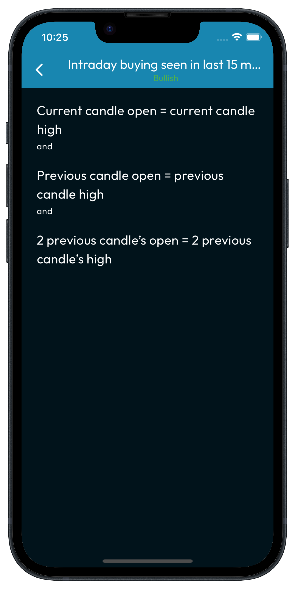
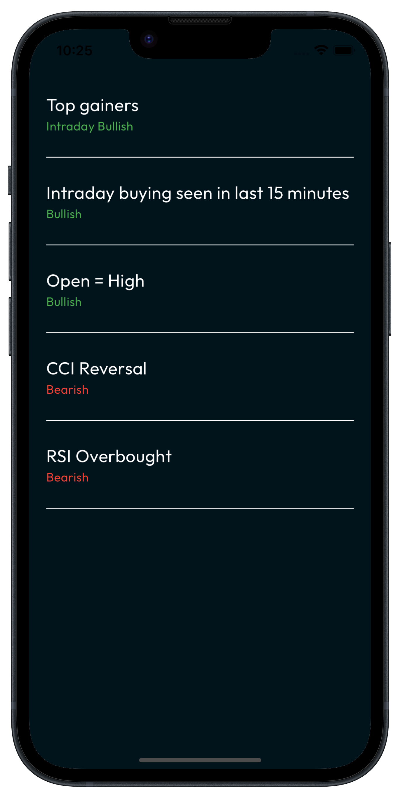
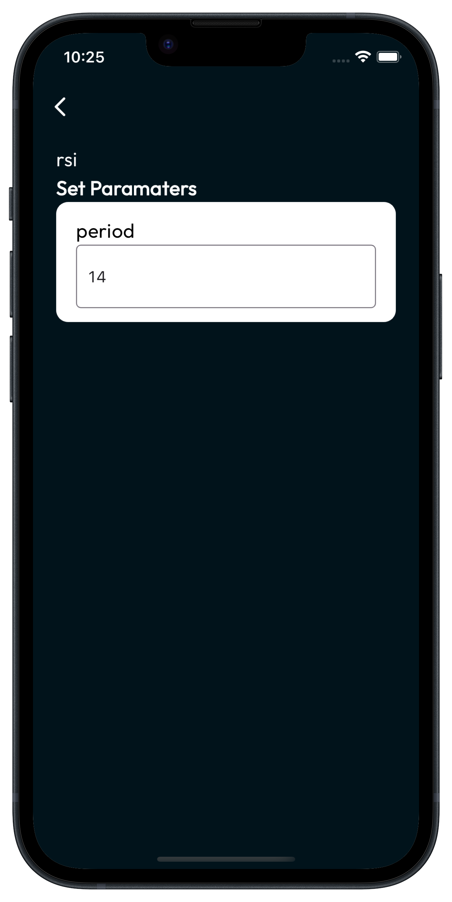
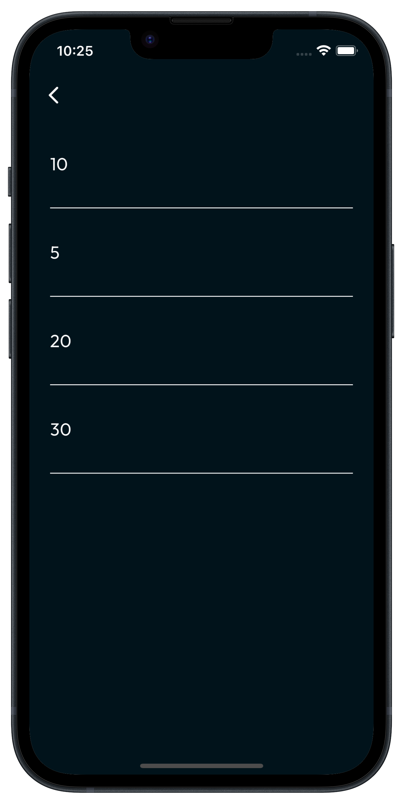
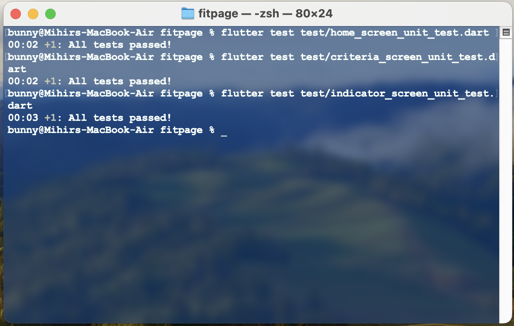

<p align="center">
  <a>
    
  </a>
  <h1 align="center">FitPage-App</h1>  
</p>

## Introduction

Monitor Fitness and Diet with provided professional Traning for Marathons and Indians First integrated heart fitness platform.

---


## :camera_flash: Screenshots

<div align="center" style="margin:auto;width:100%;display:flex;justify-content:center;align-items:center;flex-wrap:wrap;">




</div>

<br>
<br>

## :sparkles: Unit testing

<div align="center" style="margin:auto;width:100%;display:flex;justify-content:center;align-items:center;flex-wrap:wrap;">

</div>

## Development

Make Sure you have [Flutter development environment setup](https://docs.flutter.dev/get-started/install)

```bash
# Install dependencies
flutter pub get
```

```bash
# Pod installation for ios
cd ios && pod install
```

```bash
# Run
flutter run
```
